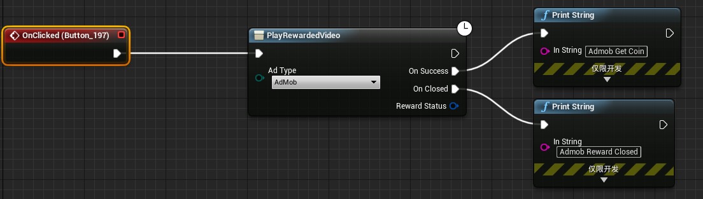
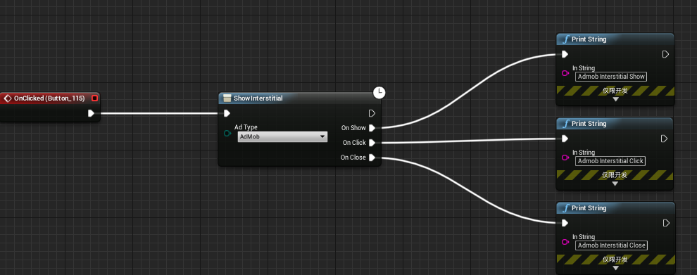
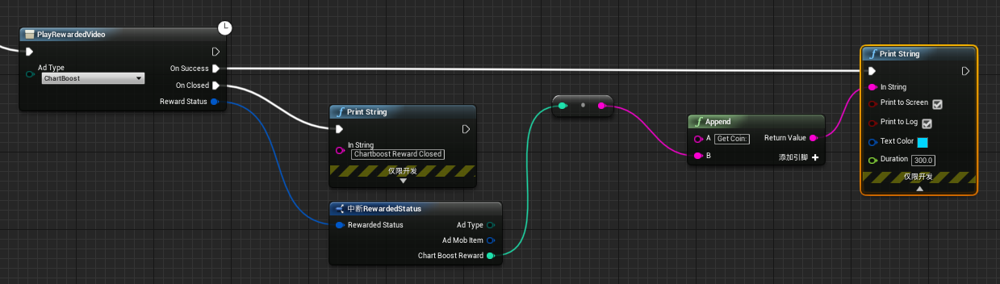

# UnrealEngine4-EZ-Mobile-Ads
One line code(or blueprint) Integrates Google AdMod and other ad networks for iOS &amp; Android.

EZ Mobile Ads help you easy integrates multiple ad networks for your game both Android and IOS same code, 
By use multiple ad networks, it will  help you maximize fill rate and increase monetization.
All features are available in C++ and Blueprint. this plugin automatic process ads reload and other detail, so
 you can easy use just call when you need.
 

# FEATURES: 
★ 4 best game ad networks supported (more coming soon).

★  all ad  networks  can enable and disable in editor setting.

★  extremely easy  integrates just one line c++ code or blueprint for both IOS and Android. plugin automatic process ads reload
  and other detail.

★  supoort unreal engine 4 4.20 4.21.

★ support via e-mail feixuwu@outlook.com

# PLATFORM SUPPORTED:
★ Android

★ IOS

# AD TYPES:
★ Banner(Admob,Facebook Audience)

★ Interstitial (text, picture, video)(Admob, ChartBoost,Facebook Audience)

★ Reward Video(Admob, Unity, ChartBoost,Facebook Audience )

# SUPPORTED AD NETWORKS(more comming soon): 
★ AdMob(Banner, Interstitial, Rewarded Video)

★ ChartBoost(Interstitial, Rewarded Video)

★ Unity(Rewarded Video)

★ Facebook Audience(Banner, Interstitial, Rewarded Video)

# Install

Watch this video to learn how to use the plugin

1、Please first confirm you installed Visual Studio 2015 or 2017, and installed c++ compile support.

2、If your project is a pure blueprint project, please add an empty c++ class to the project, or else the plugin may not be compiled.

3、Copy Plugins folder to your project root folder, double click to open your game project as usual, the engine will 
 notify you to compile the plugin, confirm to compile the plugin, wait several minutes(3-5), the editor will lauched. If there is  any problem(UBT is complicate, and some bugs), please contact me let me help you to fix it.

# Usage
  you can simply run the demo project for test, to integrates your own project, juse few steps:
  
1.Copy Plugins folder to your project and compile the editor.

2.if you package for android, change the minimum sdk version to 15.

3.Want Unity Ads? easy!!
      open project editor and find Unity Setting,  fill your application id for both Android and IOS.
      
      
4.In blueprint Editor, when you want show show the ads, just call function "PlayRewardedVideo",  setting the ad platform Unity . 
       you can add custom event to process after user complete watched the ads video.
	
	
5.Important:Remember that admob rewarded video  does not have fill rate on adnroid in most region, this is not a bug, so I suggest people switch to this plugin
 advance version: https://github.com/feixuwu/UnrealEngine4-Admob, try both have same API, it support admob mediation, 
 so you can add thirdparty ad network dynamic on the google admob webpage.
 

	  
# Other ShowCase
★ Want show Banner?
	

★ Want show interstitial?
	
	 
★ Want reward player with confiure coins from chartBoost?  
	
	
	
★ Want maximize fill rate and increase monetization?
	
	
	
# Support
  
  Email:feixuwu@outlook.com
  Remote Assistance with teamviewer
  
# License
You can use it free, and I will share 2% ads traffic.
  

# FAQ
## ★ Why My admob not show?
  There's a lot of reasons why admob not show correctly,you can install the admob test apk from 
  https://github.com/feixuwu/UnrealEngine4-EZ-Mobile-Ads/blob/master/AdmobHelpApk/AdmobTest.apk
  this apk use google official test ad unit, if it works, then the admob is working and the plugin is working correct,
  you may need check your admob account or wait some time to let ad unit active(if the ad unit is new created).
  
  to show Admob rewarded video, your phone need have google service installed, some device removed all google service,then
  the rewarded video may not show correct.
  
  here is the offical test ad unit which I copy from 
  https://github.com/googleads/googleads-mobile-android-examples
  
  you can change the admob setting to use this test ad unit to check if the plugin works on your game.
  
  
  appid:ca-app-pub-3940256099942544~3347511713
  
  banner:ca-app-pub-3940256099942544/6300978111
  
  interstitial:ca-app-pub-3940256099942544/1033173712
  
  rewarded video:ca-app-pub-3940256099942544/5224354917
  

## ★ I'm not good with C++, can I use this plugin?

  Yes, of course you can, use this plugin, you don't have to have C++ knowlege, and don't need recompile the all engine. 
  
  But you need to have visualstudio or xcode can build C++ code, just put the plugins folder under you project root folder,  
  then double click the uproject file as usual, after several minutes(3-5), the editor will launch.
  
## ★ If I use in project with engine version 4.17, it will remind me the plugin is not compatible with engine, is there compatible problem?

 No, after do some debug and read 4.17 source, I found it's the engine bug, all the plugin without binary will get the warning.
 There's a engine bug report here: https://issues.unrealengine.com/issue/UE-49007
 
 So after the engine remind you if disable the plugin, click no, and then confirm to build the plugin, next time to start the project,
 the warning will dissappear.
